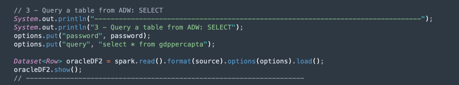
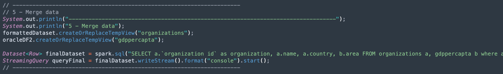
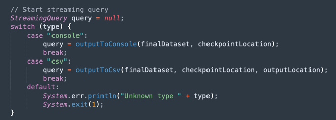
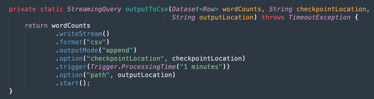
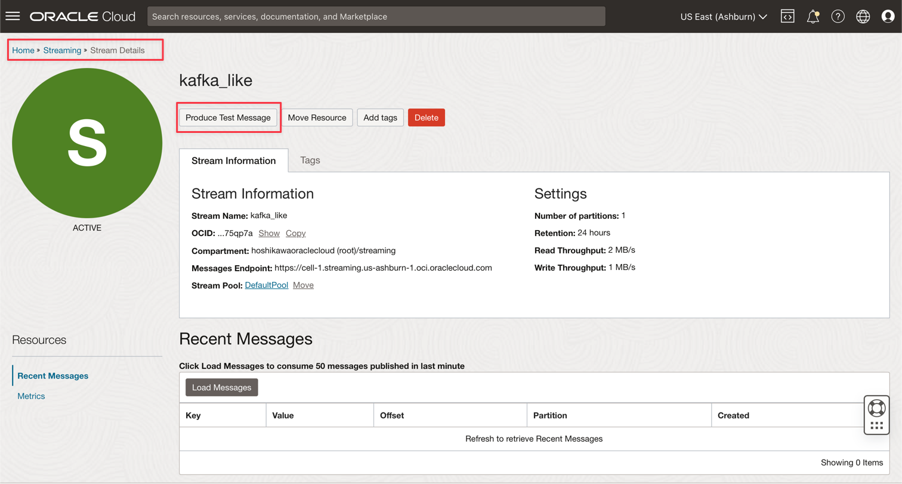
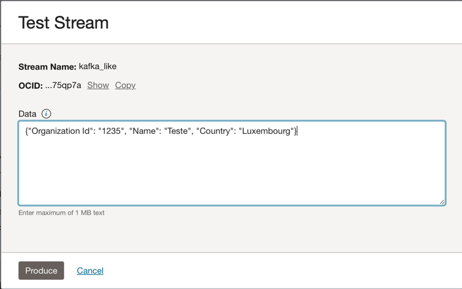
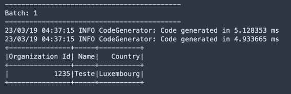
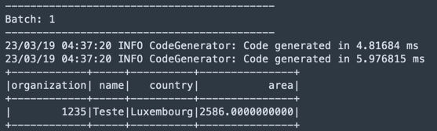
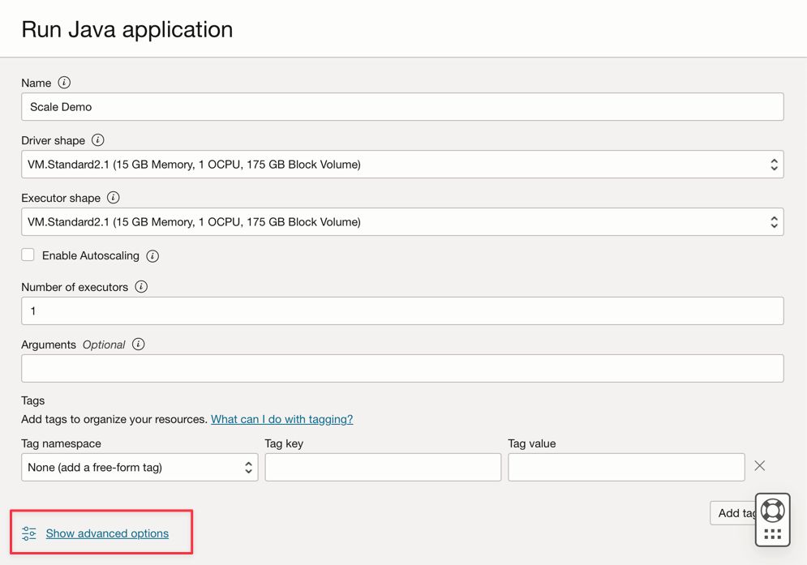
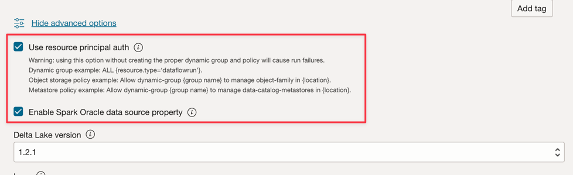

# Use Spark Streaming to process a Kafka topic near real-time 

## Introduction

Oracle Cloud Dataflow is a managed service for the great open-source project named Apache Spark.
Basically, with Spark you can use it for massive processing files, streaming and database operations. There is a lot of applications you can build with a very high scalable processing. 
Spark can scale and use clustered machines to paralellize jobs with a minimum of configuration and hard-work.

Using Spark as a managed service (Dataflow), you can add many scalable services to multiply the power of cloud processing.

Data Flow has the hability to process **Spark Streaming**.
Streaming applications require continuous execution for a long period of time that often extends beyond 24 hours, and might be as long as weeks or even months. In case of unexpected failures, streaming applications must restart from the point of failure without producing incorrect computational results. Data Flow relies on Spark structured streaming check-pointing to record the processed offset which can be stored in your Object Storage bucket.

>**Note:** If you need to process data as a batch strategy, you can read this article: [Process large files in Autonomous Database and Kafka with Oracle Cloud Infrastructure Data Flow](https://docs.oracle.com/en/learn/oci-dataflow-adw-kafka/#introduction)

In this tutorial, you can see the most common activities used to process a great data volume streaming, querying database and merge/join the data to form another table in memory or send data to any destiny near realtime. You can write this massive data into your database and in a Kafka queue. Everything with a very low-cost and high effective performance.

## Objectives

- Learn how Dataflow can be used to process a large amount of data in a scalable and near realtime application

## Prerequisites

You need:

- An **Oracle Cloud** tenant operational
>**Note**: You can create a free Oracle Cloud account with US$ 300.00 for a month to try this tutorial. See [Create a Free Oracle Cloud Account](https://www.oracle.com/cloud/free/)

- **OCI CLI** (Oracle Cloud Command Line Interface) installed on your local machine
>**Note**: This is the link to install the [OCI CLI](https://docs.oracle.com/en-us/iaas/Content/API/SDKDocs/cliinstall.htm) 

- An **Apache Spark** installed in your local machine
>**Note**: This is the official page to install: [Apache Spark](https://spark.apache.org/downloads.html). There is an alternative procedures to install Apache Spark for each type of Operational System (Linux/Mac OS/Windows). You can try this alternatives too.

- The **Spark Submit CLI** installed
>**Note**: This is the link to install [Spark Submit CLI](https://docs.oracle.com/en-us/iaas/data-flow/data-flow-tutorial/spark-submit-cli/front.htm#front)

- The **Maven** installed in your local machine

- The knowledge on OCI Concepts:

    Compartments
    IAM Policies
    Tenancy
    OCID of your Resources

## Task 1: Create the Object Storage Structure

The Object Storage will be used as a default file repository. You can use another type of file repositories, but Object Storage is a simple and low-cost way to manipulate files with performance.
In these demos, both applications will load a large CSV file from the object storage, showing how Spark is fast and smart to process a high volume of data.

First of all, you need to configure your Object Storage.

### Create a compartment

Compartments are important to organize and isolate your cloud resources. You can isolate your resources by IAM Policies.
You can use this link to understand and setup the policies to start use compartments:

[Managing Compartments](https://docs.oracle.com/en-us/iaas/Content/Identity/Tasks/managingcompartments.htm)

For this tutorial, you need to create one compartment to host all the resources of the 2 applications in this tutorial.
So please, create a compartment named **analytics**.
Go to the Oracle Cloud main menu and search for: **Identity & Security** and **Compartments**. In the Compartments section, click on the **Create Compartment** button and fill the name.

>**Note**: You need to give the access to a group of users and include your user. Please, take a look to the **Managing Compartments** to understand and setup this step.

To finish this action, click on the **Create Compartment** button to include your compartment.

### Create your bucket in the Object Storage

Now you need to create your bucket. Buckets are logical containers for storing objects, so all files used for this demo will be stored in this bucket.
Go to the Oracle Cloud main menu and search for **Storage** and **Buckets**. In the Buckets section, select your compartment (analytics), created previously:

Click on the **Create Bucket** button. Create 4 buckets:

    apps
    data
    dataflow-logs
    Wallet

Just fill the **Bucket Name** information with these 4 buckets and maintain the other parameters with the default selection.
For each bucket, click on the **Create** button.
You can see your buckets created:

>**Note:** Please review the IAM Policies for the bucket. You need to setup the policies if you want to use these buckets in your demo applications. You can review the concepts and setup here [Overview of Object Storage](https://docs.oracle.com/en-us/iaas/Content/Object/Concepts/objectstorageoverview.htm) and [IAM Policies](https://docs.oracle.com/en-us/iaas/Content/Security/Reference/objectstorage_security.htm#iam-policies)

## Task 2: Create the Autonomous Database

Oracle Cloud Autonomous Database is a managed service for the Oracle Database. For this tutorial, the applications will connect to the database through a Wallet for security reasons.
You need to instantiate the ADW following this link: [Provision Autonomous Database](https://docs.oracle.com/en/cloud/paas/autonomous-database/adbsa/autonomous-provision.html#GUID-0B230036-0A05-4CA3-AF9D-97A255AE0C08).
Choose the Data Warehouse option opening the Oracle Cloud main menu, selecting **Oracle Database** and **Autonomous Data Warehouse**; select your compartment **analytics** and follow the tutorial to create the database instance. Name your instance with **Processed Logs**, choose **logs** as the database name and you don't need to change any code in the applications.
After this, you need to stablish the ADMIN password and download the Wallet zip file.

After creating the database, you can enter on the instance and setup the **ADMIN** user password and download the **Wallet** zip file.

Save your Wallet zip file (Wallet_logs.zip) and annotate your **ADMIN** password, you will need to setup the application code.

### Save your Wallet_logs.zip file into the bucket

Go to the **Wallet** bucket opening the Oracle Cloud main menu, selecting **Storage** and **Buckets**.
Change to **analytics** compartment and you will see the **Wallet** bucket. Click on it.

To upload your Wallet zip file, just click on **Upload** button and attach the **Wallet_logs.zip** file. 

Let's go to the next Task!

## Task 3: Upload the CSV Sample Files

To demonstrate the power of Spark, the applications will read a CSV file with 1,000,000 lines.
This data will be inserted on ADW (Autonomous Data Warehouse) dabase with just one command line and will be published on a Kafka streaming (Oracle Cloud Streaming).
All these resources are scalable and perfect for a high data volume.

Download these 2 links and Upload to the **data** bucket:

[organizations.csv](./files/organizations.csv)

[organizations1M.csv](https://objectstorage.us-ashburn-1.oraclecloud.com/p/EqwMnzRwjtmes4okPLItLTOSNyq-KW9ktV5s1n4WCS_y1XpCWXDwJCkZ-PYKJeK0/n/idavixsf5sbx/b/data/o/organizations1M.csv)

The **organizations.csv** has only 100 lines, just to test the applications on your local machine.
The **organizations1M.csv** contains 1,000,000 lines and will be used to run on the Dataflow instance.

Select again the Oracle Cloud main menu, **Storage** and **Buckets**.
Click on the **data** bucket and upload these 2 files.

### Upload an auxiliary table to ADW Database

Download this file to upload to the ADW Database:

[GDP PER CAPTA COUNTRY.csv](./files/GDP_PER_CAPTA_COUNTRY.csv)

Go to Oracle Cloud main menu, select **Oracle Database** and **Autonomous Data Warehouse**.
Click on the **Processed Logs** Instance to view the details.
Click in the **Database actions** button to go to the database utilities.

Insert your credentials for the **ADMIN** user:

And click in **SQL** option to go to the Query Utilities:

Click on the **Data Load** button

Drop the **GDP PER CAPTA COUNTRY.csv** file into the console panel and proceed to import the data into a table:

Finally, you can see your new table named **GDPPERCAPTA** imported with success.

## Task 4: Create a Secret Vault for your ADW ADMIN password

For security reasons, the ADW ADMIN password will be saved on a Vault.
Oracle Cloud Vault can host this password with security and can be accessed on your application with the OCI Authentication.

To create your secret in a vault, follow this link: [Add ADW ADMIN password to Vault](https://docs.oracle.com/en/learn/data-flow-analyze-logs/index.html#add-the-database-admin-password-to-vault)

You will need to fill a variable named **PASSWORD_SECRET_OCID** in your applications with the OCID commented on this documentation.

## Task 5: Create a Kafka Streaming (Oracle Cloud Streaming)

Oracle Cloud Streaming is a Kafka like managed streaming service. You can develop applications using the Kafka APIs and common SDKs in the market.
So, in this demo, you will create an instance of Streaming and configure it to execute in both applications to publish and consume a high volume of data.

First, you need to create an instance. Select the Oracle Cloud main menu e find the **Analytics & AI** option. So go to the **Streams**.

Change the compartment to **analytics**. Every resource in this demo will be created on this compartment. This is more secure and easy to control IAM.

So, click on **Create Stream** button:

Fill the name with **kafka_like** (for example) and you could maintain all other parameters with the default values:

So click the **Create** button to initialize the instance.
Wait for the **Active** Status. Now you can use the instance.

>**Note:** In the streaming creation process, you select as default **Auto-Create a default stream pool**, so you default pool will be create automatically.

Click on the **DefaultPool** link.

Let's view the connection setting:

Annotate all these information. You will need them in next step.

## Task 6: Generate a AUTH TOKEN to access Kafka

You can access OCI Streaming (Kafka API) and other resources in Oracle Cloud with an Auth Token associated to your user on OCI IAM.
In Kafka Connection Settings, the SASL Connection Strings has a parameter named **password** and an **AUTH_TOKEN** value. See the previously section.

So, to enable access to OCI Streaming, you need to go to your user on OCI Console and create an AUTH TOKEN.
Select the Oracle Cloud main menu, **Identity & Security** and finally **Users**.
Remember that the user you need to create the **AUTH TOKEN** is the user configured with your **OCI CLI** and all the **IAM Policies** configuration for the resources created until now.
The resources are:

    Oracle Cloud Autonomous Data Warehouse
    Oracle Cloud Streaming
    Oracle Object Storage
    Oracle Dataflow

So, click on your username to view the details:

Click on the **Auth Tokens** option in the left side of the console and click on **Generate Token** button.
The token will be generated only in this step and do not will be visible anymore. So, copy the value and keep it. If you lost the value, you need to generate the auth token again.

## Task 7: Setup the Demo Application

The next step is setup some information before execute the demo.

>**DataflowSparkStreamDemo:** This application will connect to the Kafka Streaming and consume every data and merge with an ADW table named **GDPPERCAPTA**. The stream data will be merged with **GDPPERCAPTA** and will be saved as a CSV file, but it can be exposed to another Kafka topic.

The application could be downloaded here:

[DataflowSparkStreamDemo.zip](./files/DataflowSparkStreamDemo.zip)

### Find the information in your OCI Console

You will need some information that can be found on your Oracle Cloud Console:

#### Tenancy Namespace

---

#### Password Secret

---
#### Streaming Connection Settings

---
#### Auth Token

---
#### Fill the Variables values

With all these information, open you zip files (Java-CSV-DB.zip and JavaConsumeKafka.zip).
Find on each project the folder **/src/main/java/example** and find the **Example.java** code.

These are the variables that need to be changed with your tenancy resources values.

|VARIABLE NAME| RESOURCE NAME| INFORMATION TITLE|
|-----|----|----|
|bootstrapServers|Streaming Connection Settings|Bootstrap Servers|
|streamPoolId|Streaming Connection Settings|ocid1.streampool.oc1.iad..... value in SASL Connection String|
|kafkaUsername|Streaming Connection Settings|value of usename inside " " in SASL Connection String| 
|kafkaPassword|Auth Token|The value is displayed only in the creation step|
|OBJECT_STORAGE_NAMESPACE|TENANCY NAMESPACE|TENANCY|
|NAMESPACE|TENANCY NAMESPACE|TENANCY|
|PASSWORD_SECRET_OCID|PASSWORD_SECRET_OCID|OCID|

>**Note:** All the resources created for this demo are in the US-ASHBURN-1 region. Check in what region you want to work. If you change the region, you need to change 2 points in 2 code files:
> 
> **Example.java**: Change the **bootstrapServers** variable, replacing the "us-ashburn-1" with your new region
>
> **OboTokenClientConfigurator.java**: Change the **CANONICAL_REGION_NAME** variable with your new region 

## Task 8: Understand the Java Code

This demo was created in Java and this code can be portable to Python with no problem.

The application, to prove the efficience and scalability, was developed to show some possibilities in a common use case of an integration process. 

    Connect to the Kafka Stream and read the data 
    Process JOINS with an ADW table to build a useful information
    Output a CSV file with every useful information came from Kafka

Oracle Cloud Dataflow is a managed service for Apache Spark. This demo can be executed in your local machine and can be deployed into the Dataflow instance to run as a job execution. The workflow for a developer is very easy and fast.

>**Note:** Both, Dataflow job and you local machine, use the OCI CLI configuration to access the OCI resources.
In the Dataflow side, everything is pre-configured, so no need to change the parameters. In your local machine side, you installed previously the OCI CLI and configure the tenant, user and private key to access your OCI resources.

Let's show the Example.java code in sections:

#### Spark initialization

This part of code represents the Spark initialization. Many confirations to perform execution processes are configured automatically, so it's very easy to work with the Spark engine.
The initialization differs if you are running inside the **Data Flow** or in your local machine.
If you are in **Data Flow**, you don't need to load the **ADW Wallet zip file**, the task of load, uncompress and read the Wallet files are automatic inside the Data Flow environment, but in the local machine, it needs to be done with some commands.

#### Read the ADW Vault Secret

This part of code access your vault to obtain the secret of your ADW instance.

#### Query an ADW Table

This section show how to execute a query to a table

#### Kafka Operations

This is the preparation for connect to the OCI Streaming, using the Kafka API.

>**Note:** Oracle Cloud Streaming is compatible with the most Kafka APIs.

There is a process to parse the **JSON** data came from **Kafka** topic into a **dataset** with the correct structure (Organization Id, Name, Country).

#### Merge the data from a Kafka Dataset and ADW Dataset

This section shows how to execute a query with 2 datasets.

#### Output into a CSV File

Here is how the merged data generates the output into a CSV File

## Task 9: Package your Application with Maven

Before execute the job in Spark, it's necessary to package you application with Maven.
Maven is one of the most known utilities to package applications with libraries and plugins. Let's package the application:

### DataflowSparkStreamDemo Package

Go to **/DataflowSparkStreamDemo** folder and execute this command:

    mvn package

You can see **Maven** starting the packaging:

If everything is correct, you can see **Success** message:

## Task 10: Verify the Execution

To test you application in your local Spark machine, just execute this command:

    spark-submit --class example.Example target/consumekafka-1.0-SNAPSHOT.jar

Go to your **Oracle Cloud Streaming** Kafka instance and click into "Produce Test Message" to generate some data to test you realtime application.

You can put this JSON message into the kafka topic:

    {"Organization Id": "1235", "Name": "Teste", "Country": "Luxembourg"}

Each click to Produce button, you put one message to the application.
you can see the application's output log something like this:

This is the data read from the kafka topic

And this is the merged data from ADW table

## Task 11: Create and Execute a Dataflow Job

Now, with both applications running with success in your local Spark machine, you can deploy them into the **Oracle Cloud Dataflow** in your tenancy.

>**Note:** Visit the **Spark Streaming** documentation to configure access to resources like Oracle Object Storage and Oracle Streaming (Kafka): [Enable Access to Data Flow](https://docs.oracle.com/pt-br/iaas/data-flow/using/dfs_getting_started.htm#resource-principal-policies)

### Upload the packages into Object Storage

Before create a **Data Flow** application, you need to upload your Java artifact application (your *****-SNAPSHOT.jar** file) into the **Object Storage** bucket named **apps**.

### Create a Dataflow Application

Select the Oracle Cloud main menu and go to **Analytics & AI** and **Data Flow**.
Be sure to select your **analytics** compartment before create a Dataflow Application.

Click on **Create application** button:

And now, fill the parameters like this:

Click on **Create** button.
After creation, click on the **Scale Demo** link to view details. To run a Job, click on the **RUN** button.

>**Note:** Click on the **Show advanced options** to enable the OCI security for the **Spark Stream** execution type:

And activate the options:

Now click on the **Run** button to execute the job.
Confirm the parameters and click **Run** again:

It's possible to view the Status of the job:

Wait until the Status go to **Succeeded** and you can see the results.

## Related Links

- [Free OCI](https://www.oracle.com/cloud/free/)

- [Dataflow Documentation](https://docs.oracle.com/en-us/iaas/data-flow/data-flow-tutorial/getting-started/dfs_tut_get_started.htm#get_started)

- [Dataflow Pre-requisites](https://docs.oracle.com/en-us/iaas/data-flow/using/dfs_getting_started.htm#set_up_admin)

- [Spark submit CLI](https://docs.oracle.com/en-us/iaas/data-flow/data-flow-tutorial/spark-submit-cli/front.htm#front)

- [OCI CLI](https://docs.oracle.com/en-us/iaas/Content/API/SDKDocs/cliinstall.htm)

- [Install Apache Spark](https://spark.apache.org/downloads.html)

- [Compartments](https://docs.oracle.com/pt-br/iaas/Content/Identity/Tasks/managingcompartments.htm)

- [Provision Autonomous Database](https://docs.oracle.com/en/cloud/paas/autonomous-database/adbsa/autonomous-provision.html#GUID-0B230036-0A05-4CA3-AF9D-97A255AE0C08)

- [Add ADMIN password to Vault](https://docs.oracle.com/en/learn/data-flow-analyze-logs/index.html#add-the-database-admin-password-to-vault)

- [Create Oracle Cloud Streaming](https://blogs.oracle.com/developers/post/getting-started-with-oracle-streaming-service-oss)

- [Process large files in Autonomous Database and Kafka with Oracle Cloud Infrastructure Data Flow](https://docs.oracle.com/en/learn/oci-dataflow-adw-kafka/#introduction)

- [Spark Streaming](https://docs.oracle.com/pt-br/iaas/data-flow/using/spark-streaming.htm)
## Acknowledgments

- **Author** - Cristiano Hoshikawa (Oracle LAD A-Team Solution Engineer)
